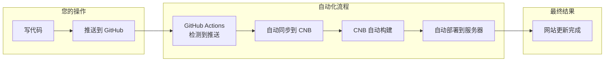
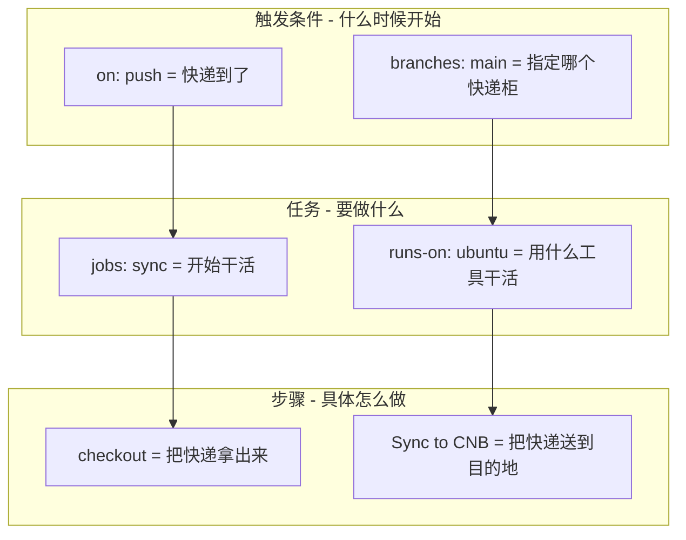
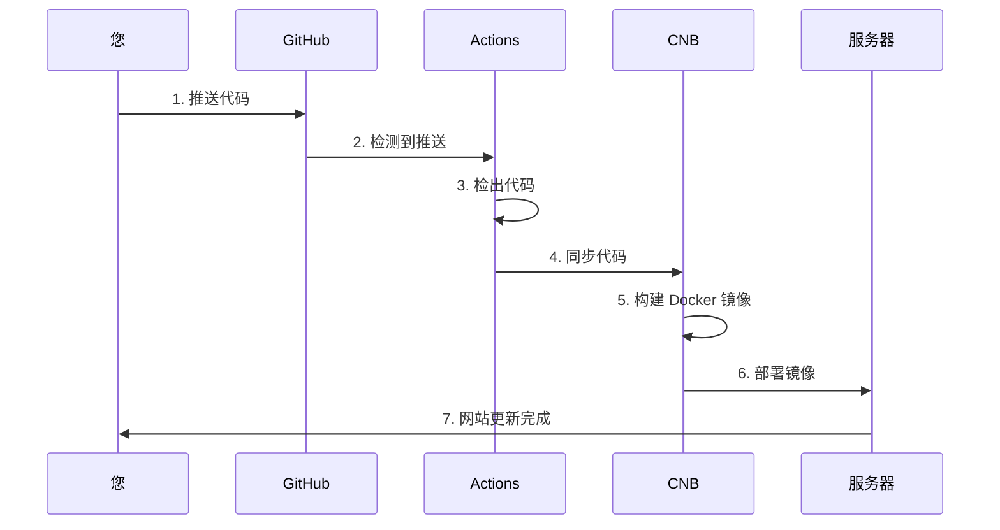

好的！我来给您做一个从头到尾的详细讲解，让小白也能听懂。

---

## **一、先理解基本概念**

### **1. 什么是 CI/CD？**

用一个生活中的例子来解释：

```
传统开发流程（手动）：
写代码 → 手动打包 → 手动上传服务器 → 手动重启 → 完成
         👆 这里容易出错，很麻烦

CI/CD 自动化流程：
写代码 → 推送到 GitHub → 自动打包 → 自动上传 → 自动部署 → 完成
         👆 全自动，不用管了
```

- **CI（持续集成）**：代码推送后，自动检查、自动构建
- **CD（持续部署）**：构建完成后，自动部署到服务器

### **2. 整个流程是怎么工作的？**



---

## **二、涉及的各个平台**

### **1. GitHub 是什么？**

GitHub 就像一个**代码仓库**，存放您的代码，并且可以多人协作。

```
GitHub = 代码存放的地方 + 团队协作平台
```

### **2. CNB 是什么？**

CNB（云原生构建）是腾讯云提供的**自动化构建平台**。

```
CNB = 自动帮您打包代码 + 构建镜像 + 部署应用
```

### **3. 为什么需要两个平台？**

| 平台 | 作用 | 比喻 |
|------|------|------|
| GitHub | 存放代码 | 原材料仓库 |
| CNB | 构建和部署 | 加工厂 |
| 轻量服务器 | 运行应用 | 成品展示店 |

---

## **三、配置文件详解**

### **1. GitHub Actions 配置文件**

这个文件告诉 GitHub：**什么时候**、**做什么事**。

```yaml
# ==================== 基本信息 ====================
name: Sync to CNB              # 这个工作流的名字，随便起

# ==================== 触发条件 ====================
on:                            # 定义什么时候触发这个工作流
  push:                        # 当有人推送代码时
    branches:                  # 指定哪些分支
      - main                   # main 分支
      - master                 # master 分支
  workflow_dispatch:           # 允许手动点击运行

# ==================== 执行任务 ====================
jobs:                          # 定义要做的任务
  sync:                        # 任务名称（随便起）
    runs-on: ubuntu-latest     # 用什么系统来跑（Ubuntu 是一种 Linux 系统）
    
    steps:                     # 具体步骤
      # 步骤1：把代码拿出来
      - uses: actions/checkout@v4
        with:
          fetch-depth: 0       # 拿全部历史记录
      
      # 步骤2：同步到 CNB
      - name: Sync to CNB
        run: |                 # 执行命令
          docker run --rm \    # 运行一个 Docker 容器
            -v "$:$" \         # 把代码目录挂载进去
            -w "$" \           # 设置工作目录
            -e PLUGIN_TARGET_URL="https://cnb.cool/pudding-2024/FrontendNext.git" \
            -e PLUGIN_AUTH_TYPE="https" \
            -e PLUGIN_USERNAME="cnb" \
            -e PLUGIN_PASSWORD="$" \
            -e PLUGIN_FORCE="true" \
            tencentcom/git-sync
```

### **2. 用生活例子理解配置**



---

## **四、关键概念解释**

### **1. 什么是 Docker？**

Docker 就像一个**标准化的打包盒**：

```
没有 Docker：
代码 → 在你的电脑能跑 → 在服务器可能跑不了 ❌

有 Docker：
代码 + 环境 → 打包成 Docker 镜像 → 在任何地方都能跑 ✅
```

### **2. 什么是镜像？**

镜像就是**一个完整的软件包**，包含：
- 代码
- 运行环境（Node.js、Python 等）
- 配置文件

```
镜像 = 代码 + 环境 + 配置 = 可以直接运行的程序
```

### **3. 什么是容器？**

容器就是**运行中的镜像**：

```
镜像 = 安装包（还没运行）
容器 = 正在运行的程序（已经运行）
```

---

## **五、完整流程图解**



---

## **六、常见问题解答**

### **Q1：为什么要用 Token？**

```
Token = 门禁卡

没有 Token：谁都能进 ❌
有 Token：只有持卡人能进 ✅
```

### **Q2：为什么要在 GitHub 添加 Secret？**

```
Secret = 保险柜

Token 很重要，不能直接写在代码里
放在 Secret 里，安全又方便使用
```

### **Q3：为什么需要两个配置文件？**

| 文件 | 作用 | 在哪里 |
|------|------|--------|
| `sync-to-cnb.yml` | 同步代码到 CNB | GitHub |
| `.cnb.yml` | 构建和部署 | CNB |

---

## **七、下一步：配置 CNB 自动部署**

现在 GitHub → CNB 的同步已经好了，下一步需要在 CNB 配置 `.cnb.yml` 来实现自动构建和部署。

需要我继续讲解 CNB 的配置吗？